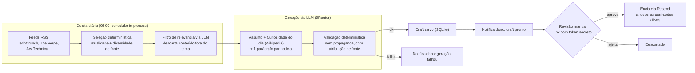
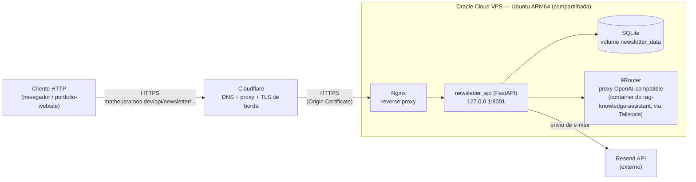

# Newsletter

Backend de uma newsletter diária de tecnologia, com geração de conteúdo assistida por LLM e um passo de aprovação humana antes de qualquer envio — coleta notícias reais via RSS, gera a edição, espera o dono aprovar por um link protegido e só então envia aos assinantes.

**Demo ao vivo**: [https://matheusramos.dev/newsletter/](https://matheusramos.dev/newsletter/) — mostra a última edição enviada e permite assinar. Integrado ao meu [portfolio-website](https://matheusramos.dev), rodando na mesma VPS que o [rag-knowledge-assistant](https://matheusramos.dev/projects/rag/).

## Como funciona



Nenhum conteúdo é inventado: se uma notícia não vem de um item real de feed, ela simplesmente não existe pra newsletter. E nenhum e-mail sai sem uma aprovação humana explícita — a geração automática só produz um **draft**.

### Deploy



`newsletter_api` roda como um container Docker isolado (nome de projeto Compose explícito, pra não colidir com o `rag-knowledge-assistant` que também usa uma pasta `docker/`) na mesma VPS que hospeda `portfolio-website` e `rag-knowledge-assistant` — reaproveita o gateway LLM (9Router) já rodando lá em vez de subir outro. Detalhes completos em [`DEPLOY.md`](DEPLOY.md).

## Stack

- **API**: FastAPI + Uvicorn
- **Armazenamento**: SQLite (assinantes e edições, sem ORM)
- **Agendamento**: APScheduler (job diário in-process, sem cron externo)
- **Notícias**: feedparser (RSS) + texto completo da matéria quando o RSS é curto
- **Curiosidade do dia**: eventos reais da API "On this day" da Wikipedia (o LLM só escolhe e reescreve)
- **LLM**: 9Router (gateway OpenAI-compatible, mesmo padrão de integração usado no `rag-knowledge-assistant`)
- **Envio**: Resend (e-mail transacional), com One-Click Unsubscribe (RFC 8058)
- **Deploy**: Docker Compose numa VPS Oracle Cloud, atrás de Nginx + Cloudflare

## Estrutura do projeto

```
app/
  api/         # rotas FastAPI (subscribe, review, latest edition) e entrypoint
  config/      # settings via variáveis de ambiente
  delivery/    # template de e-mail, envio via Resend, notificações ao dono
  generation/  # cliente LLM, prompts, pipeline de geração, filtro de relevância, validação
  news/        # coleta RSS e seleção determinística de notícias
  storage/     # acesso a SQLite (assinantes e edições)
  scheduler.py # job diário in-process (APScheduler)
scripts/       # entrypoints manuais (subir API, gerar edição sob demanda)
tests/         # suíte pytest
docs/          # contrato de API pro portfolio-website consumir
openspec/      # specs e histórico de decisões de design (OpenSpec)
docker/        # Dockerfile e docker-compose de deploy
infra/nginx/   # snippet de proxy reverso a ser mesclado no domínio principal
```

## Rodando localmente

```bash
python3 -m venv .venv
source .venv/bin/activate
pip install -r requirements.txt

cp .env.example .env
# preencha pelo menos LLM_BASE_URL/LLM_MODEL, RESEND_API_KEY e
# REVIEW_SECRET_TOKEN pra geração/envio funcionarem de verdade
```

```bash
python scripts/run_api.py
# API sobe em http://127.0.0.1:8001 (com --reload)
```

Disparar a geração da edição do dia manualmente, sem esperar o scheduler:

```bash
python scripts/generate_now.py
```

## Testes

```bash
pytest
```

76 testes, cobrindo seleção de notícias, filtro de relevância, geração e validação de draft, template de e-mail, fluxo de aprovação/rejeição, scheduler e API (subscribe/unsubscribe, revisão, edição pública).

## Configuração

Variáveis de ambiente (ver [`.env.example`](.env.example) para a lista completa e comentada):

| Variável | Descrição |
| --- | --- |
| `DB_PATH` | Caminho do arquivo SQLite |
| `LLM_BASE_URL`, `LLM_API_KEY`, `LLM_MODEL` | Endpoint do 9Router e modelo do combo em uso |
| `GENERATION_MAX_TOKENS`, `GENERATION_TEMPERATURE` | Parâmetros de geração |
| `NEWS_MAX_ITEMS` | Número máximo de notícias por edição |
| `RESEND_API_KEY`, `NEWSLETTER_FROM_ADDRESS` | Envio via Resend |
| `NEWSLETTER_OWNER_EMAIL`, `REVIEW_BASE_URL` | Notificação de "draft pronto para revisão" |
| `REVIEW_SECRET_TOKEN` | Token que protege os endpoints de aprovação/rejeição |

## Trade-offs e decisões de design

**Draft gerado automaticamente, envio sempre manual.** A geração diária roda sozinha, mas nada sai pros assinantes sem eu clicar em "aprovar" — um link com token secreto, enviado por e-mail quando o draft fica pronto. Evita o risco de um LLM sem supervisão mandando conteúdo ruim (ou alucinado) pra uma lista real de gente, ao custo de exigir uma ação manual diária.

**Duas etapas de seleção de notícia, não uma.** Uma seleção determinística (atualidade + diversidade de fonte, `app/news/selection.py`) nunca falha e serve de base segura; por cima dela, um filtro de relevância via LLM (`app/generation/relevance.py`) resolve o critério que regra fixa não cobre bem — "isso é mesmo notícia de tech, ou só cultura/estilo de vida publicado num site de tech?" — com fallback pra seleção determinística se o LLM falhar ou responder algo não-parseável.

**Validação determinística do texto gerado, além do prompt.** Prompt bem escrito não é garantia: `app/generation/validation.py` checa depois da geração se sobrou propaganda residual ou se uma notícia ficou sem atribuição de fonte, e marca a edição como `incomplete` (pra revisão manual) em vez de arriscar aprovar/enviar conteúdo fora do padrão.

**Assinatura própria em SQLite, não uma lista gerenciada por ESP.** Persisto os e-mails no meu banco em vez de depender de uma lista de terceiro — troco simplicidade de gerenciamento por controle total sobre os dados dos assinantes, adequado à escala atual (um único serviço, sem necessidade de segmentação/analytics avançados).

**Scheduler in-process (APScheduler), não um container de cron separado.** Menos uma peça de infraestrutura pra manter numa VPS que já hospeda múltiplos serviços — o custo é o job de geração morrer se a API cair, mas o fluxo de "notifica o dono se a geração falhar" já cobre esse caso.

**Aprovação via link com token, não um sistema de login completo.** Meio termo entre "endpoint aberto" e "autenticação de verdade" — barato de implementar e suficiente pra um único usuário admin (eu), sem senha pra lembrar nem sessão pra gerenciar. Os botões de aprovar/rejeitar fazem `POST` de verdade (formulário, não link `GET` de um clique) justamente pra não serem acionados por scanners de segurança de e-mail que pré-buscam links antes do dono sequer abrir a mensagem.

## Integração cross-repo

O botão de assinatura em si vive no `portfolio-website` (repositório separado). O contrato estável que ele consome está em [`docs/api-contract.md`](docs/api-contract.md) (`/subscribe`, `/unsubscribe`, `/latest`).
